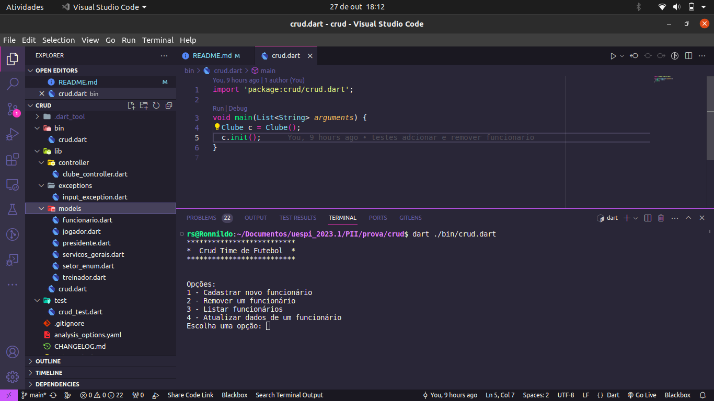

# TRABALHO PRÁTICO
 Trabalho prático para a disciplina de programação orientada a objetos. 
 O objetivo deste trabalho foi a criação de um sistema CRUD a partir de um determinado tema escolhido.
## CRUD
O que é um CRUD? 
- CRUD (Create, Read, Update, Delete) é um acrônimo para as maneiras de se operar em informação armazenada. É um mnemônico para as quatro operações básicas de armazenamento persistente. CRUD tipicamente refere-se a operações perfomadas em um banco de dados ou base de dados, mas também pode aplicar-se para funções de alto nível de uma aplicação, como exclusões reversíveis, onde a informação não é realmente deletada, mas é marcada como deletada via status.

## Trabalho Desenvolvido

O tema escolhido para o desenvolvimento deste trabalho foi clube de futebol, neste trabalho foi desenvolvido um sistema para gerenciamento de contratação, remorção, atualização de dados e listagem de funcionários do clube de futebol.

Para o desenvolvimento foi utilizado a linguagem dart e o padrão MVC, além dos recursos da orientação a objetos.

O CRUD é executado através da linha de comando, utilizando os seguites comandos:
`dart ./bin/crud.dart` || ``` cd bin \ dart  crud.dart ```

